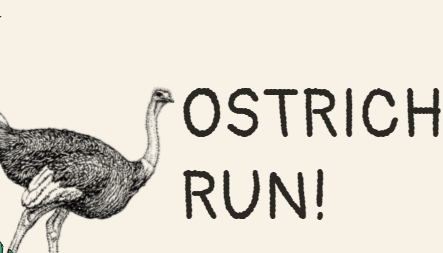
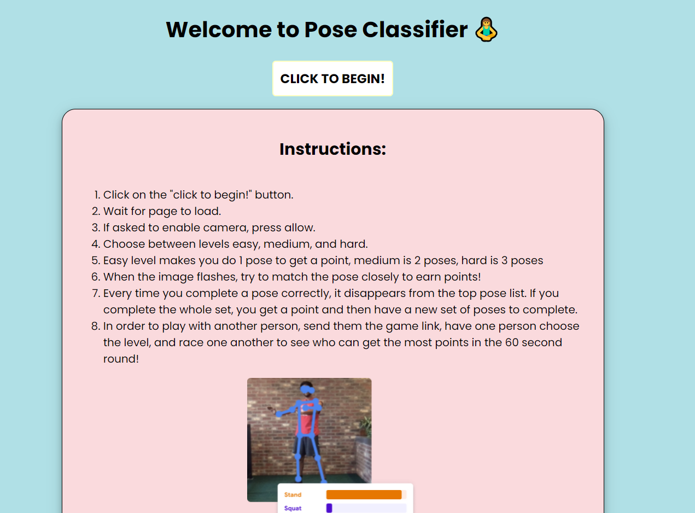
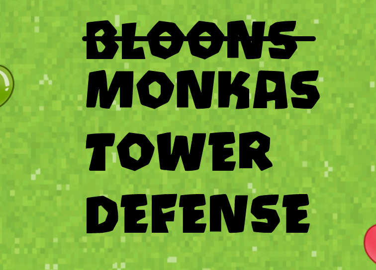
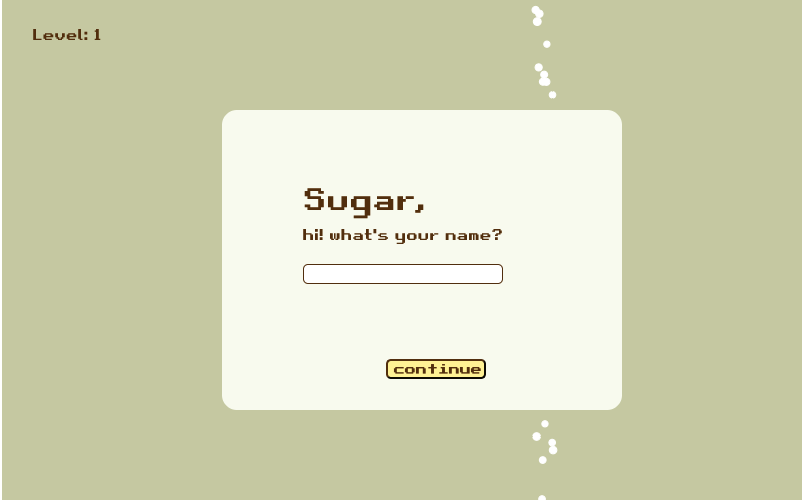
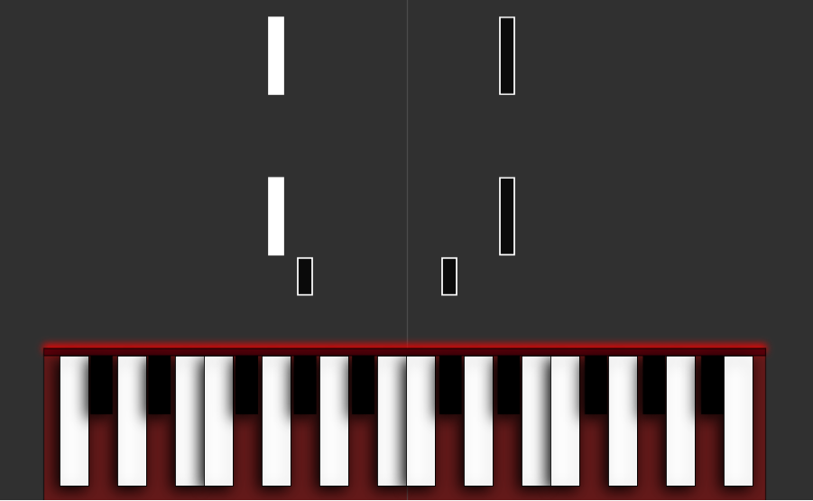
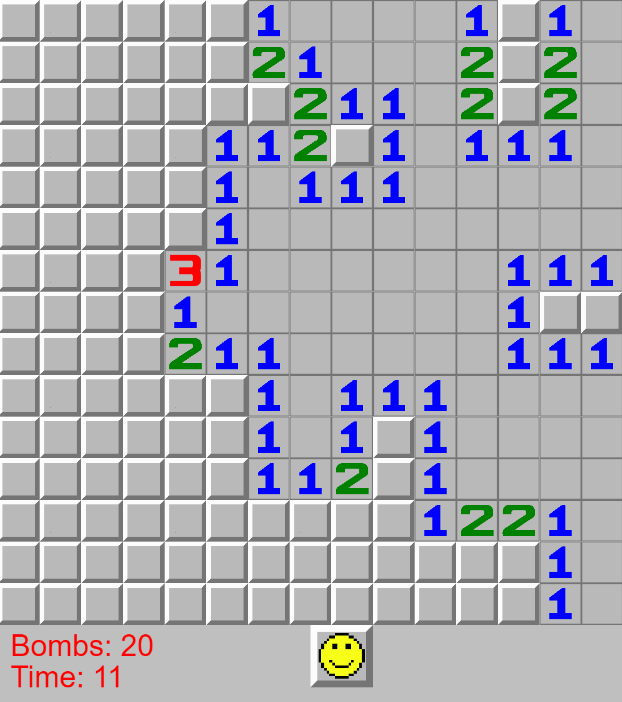

# Team 1: The Hunt by Esteemed Investigators
> Kaye, Madison, Tiffani
> 
This project is a scavenger hunt game. The computer will select an item for the player to find. The player will gain points if they find the item,  and if they have the options to skip over the item and come back to it or completely remove it, but lose points.

[[link]](https://the-hunt-finalproject.glitch.me/) [[source]](https://glitch.com/edit/#!/the-hunt-finalproject)

    

# Team 2: Ostrich Run by Jungle Enterprises
> Chimdi, Stella, Victor

Our project starts with the story of an ostrich who's lost her eggs. As she saves her babies she avoids lions who will kill her, and snakes who will steal and eat her baby. A mobile version is also available [here](https://complete-observant-substance.glitch.me/).

[[link]](https://ostrich-run.glitch.me/) [[source]](https://glitch.com/edit/#!/ostrich-run)

    

# Team 3: Pose Classifier
> Carissa, Grace, Saron

Pose Classifier is a fun, virtual multiplayer game to help improve short-term memory and get people to move their body. After choosing a level, demo pose(s) will flash on your screen. The player must recreate them from memory, and once done correctly, will earn a point. Play with your friends and race to get as many points as possible in 60 seconds!

[[link]](https://pose-classifier.glitch.me/) [[source]](https://glitch.com/edit/#!/pose-classifier)

    

# Team 4: MonkaS Tower Defense by Ninja Keiry
> Keiry, Nithya, Robert

A tower defense game based off of BTD 5.

[[link]](https://monkas-tower-defense.glitch.me/) [[source]](https://glitch.com/edit/#!/monkas-tower-defense)

    

# Team 6: Sugar
> Ananya, Christine, Van

Choose a drink --tea or coffee-- to get started! You will need to guide the sugar down into the coffee or tea by drawing lines through mouse clicks - who wants a drink without sugar. When a drink asks for brown sugar, make sure to pass the sugar through the brown color change converter platform to change white sugar to brown :)

[[link]](https://sugar-game-.glitch.me/) [[source]](https://glitch.com/edit/#!/sugar-game-)

    

# Team 8: Piano Tiles by MET
> Erick, Melanie, Temi

Our program is a piano simulator with tiles falling down for a sample song we hardcoded in. We used the WebMidi API to allow the user to be able to connect their own piano keyboard (midi) and have the program, in real-time, show what key is being pressed. We hope to expand our project to let the user import their own midi files to practice along to.

[[link]](https://piano-tiles.glitch.me/) [[source]](https://glitch.com/edit/#!/piano-tiles)

    

# Team 9: Distraction Extension by JES
> Evelyn, Jose, Sneha

Our extension is created to form a distraction during stressful times. As well as provides quotes for encouragement. Our extension will host a simple game with a satisfying GUI that the user can turn to right on their browser and have a bit of distraction for a few minutes in order to feel refreshed and ready to do work again.

[[source]](https://drive.google.com/drive/folders/15_yJvMrtb52sGLqVwVl_hBFOpths-zWv?usp=sharing)

    

# Team 10: JS Minesweeper by Lovely Handsome President
> Hector, Lydia, Pierce

A ground-up remake of the classic Minesweeper game using JavaScript.

[[link]](https://team-10-final-project.glitch.me/) [[source]](https://glitch.com/edit/#!/team-10-final-project)

    

